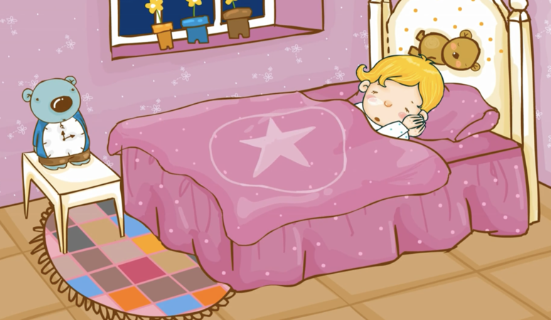
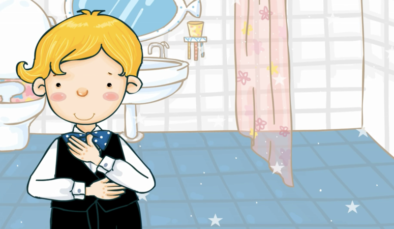
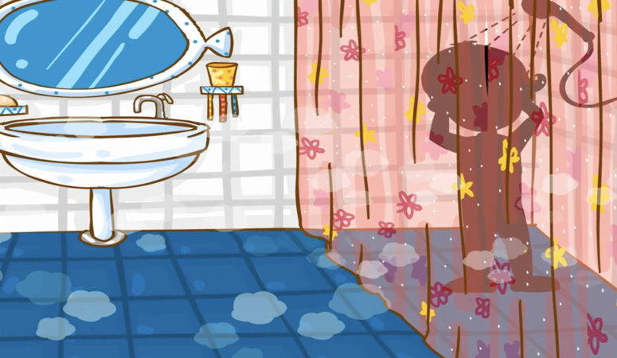
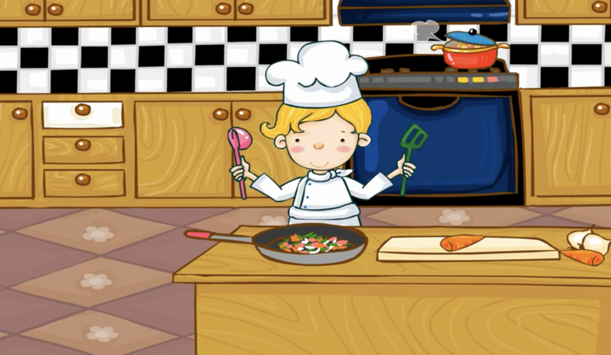
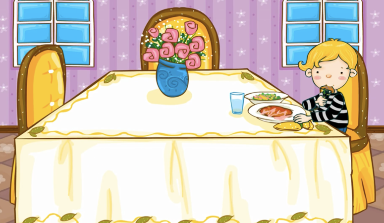
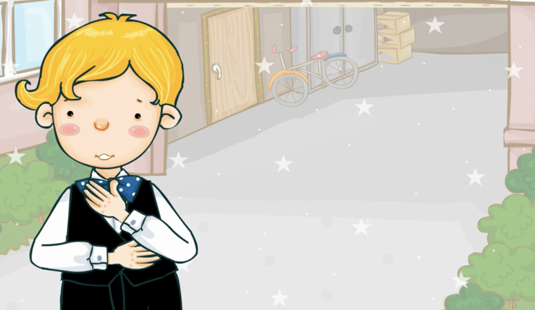
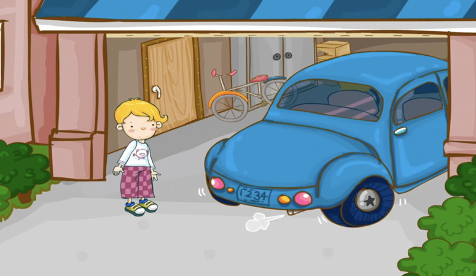
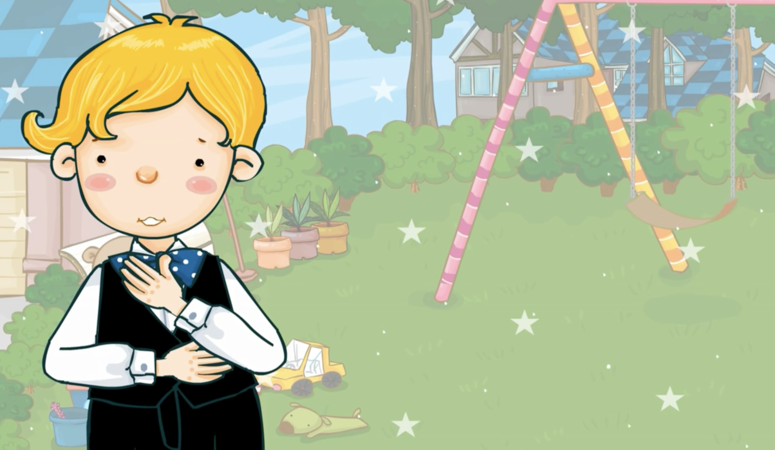
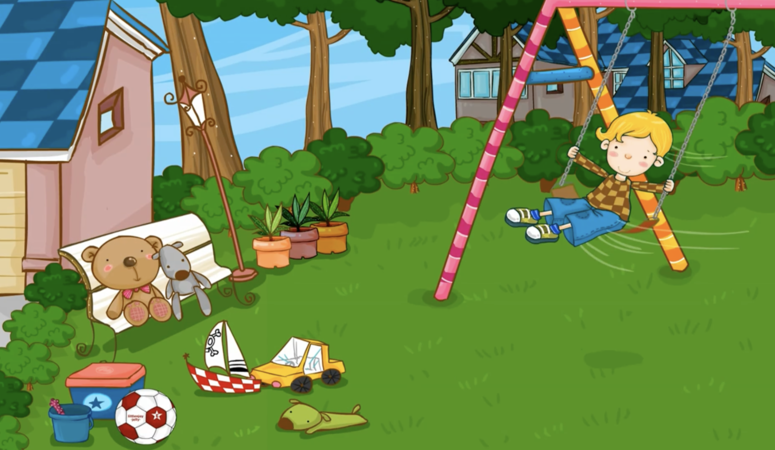
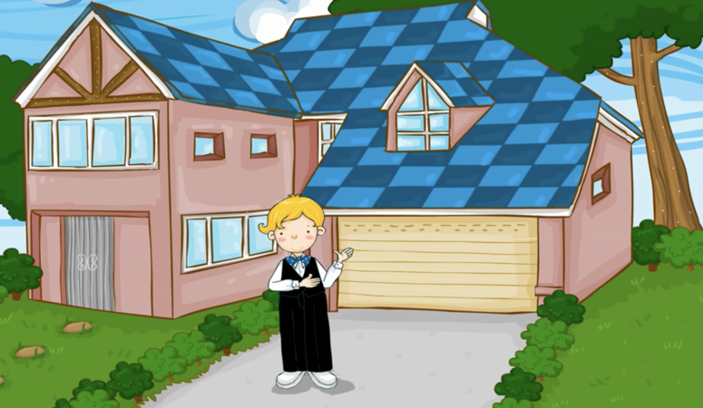

## 這是我睡覺的房間。

### Voici la chambre où je dors.

## 我在臥室裏睡覺。

### Je dors dans la chambre à coucher.

## 這是我洗澡的地方。

### Voici l'endroit où je prends ma douche.

## 我在洗手間裏洗澡。

### Je prends ma douche dans la salle de bains.

## 這是我做飯的地方。 

### Voici l'endroit où je cuisine.

## 我在廚房裏做飯。

### Je cuisine dans la cuisine.

## 這是我吃飯的地方。

### Voici l'endroit où je mange. 

## 我在餐廳裏吃飯。

### Je mange dans la salle à manger.

## 這是我跟爸爸交談的地方。 

###  C'est l'endroit où je discute avec mon papa.

## 我跟爸爸在客廳裏說話。

### Je discute avec mon père dans le salon.

## 這是我們停車的地方。

### Voici l'endroit où nous garons notre voiture.
## 我們把車停在車庫裏。

### Nous garons la voiture dans le garage.

## 這是我玩兒的地方。 

### Voici l'endroit où je joue.

## 我在院子裏玩兒。

### Je joue dans le jardin. 

## 這是我的家。我和爸爸媽媽住在一起。  
## “溫暖的家！”

### Voici ma maison. Je vis ici avec mon père et ma mère. 
### Une "maison chaleureuse !"
