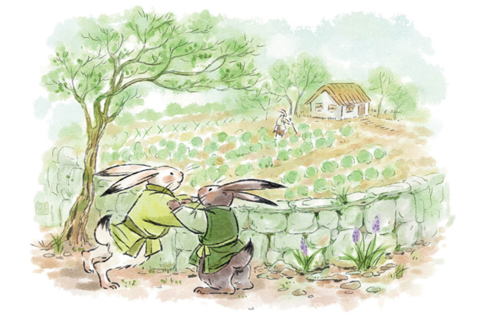
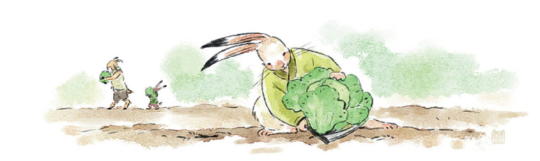
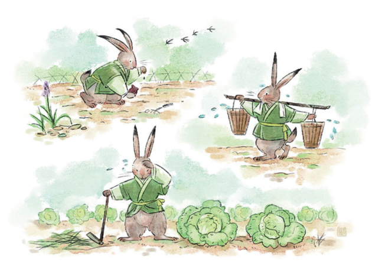
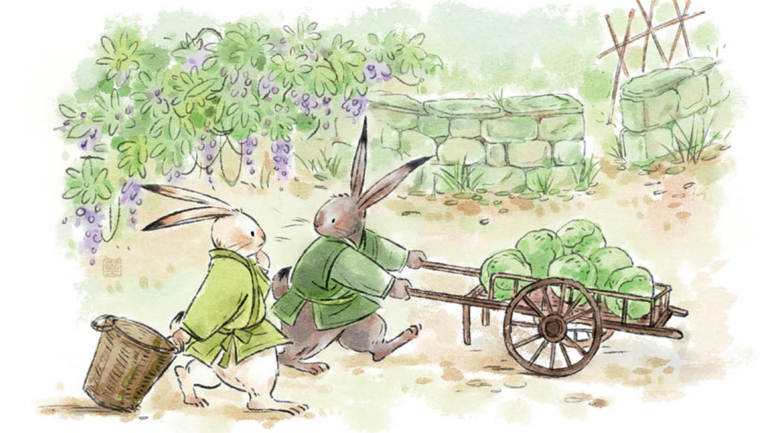
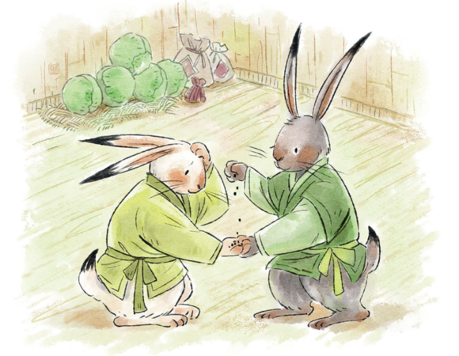

# Deux petits lapins

## 小白兔和小灰兔是最好的朋友。有一天， 他們倆在外頭玩耍，小白兔看見旁邊的一個菜園子裡長著綠油油的白菜，就想跳過去吃上幾口。小灰兔馬上跳到小白兔面前，不讓它過去，並大聲的說："你不應該去吃那些白菜！那是老山羊的菜園子。再說了，白菜還很小呢！不過， 我有個主意，等白菜長大了，我們來幫老山羊收白菜吧。他肯定會獎勵咱們一些白菜的。

> 

## 這時候，小白兔看見老山羊在菜園子裡鋤草， 他們倆就跑過去跟老山羊聊了起來。"你們要來幫我收白菜，那可太好了！"老山羊高興的說："今年的白菜一定會大豐收！要是你們到時候來幫我， 我就給你們倆每人一車白菜。你們下個星期來吧！"

> 

## 一個星期後，小白兔和小灰兔去幫老山羊收白菜了。他們一起從早幹到晚，勞動了一整天，收了滿滿20車白菜。老山羊照先前答應的， 告訴兩只小兔每人可以得到一車白菜。小白兔很快裝好了一車白菜以後， 就跟老山羊說："謝謝老山羊！我把白菜送回家就把車還回來哈！"

> 

## 小灰兔跟老山羊一邊等小白兔送車回來一邊閒聊著。老山羊把種白菜的方法都告訴了小灰兔。小灰兔聽著聽著， 突然有了個新主意，就跟老山羊說："老山羊，我不想白菜了， 給我一些白菜種子怎麼樣？"老山羊有點驚訝，但還是很高興地給了小灰兔一包種子， 也給了他幾棵白菜。小灰兔一回家就忙活起來了， 先把種菜的家伙拿出來， 然後開始松土，把白菜種子種了下去。從那天開始，小灰兔每天照看自己的菜園子，澆水，施肥， 鋤草， 殺蟲。一個月以後， 白菜就長大了， 可以收穫了。

## 小白兔呢， 每天只知道玩兒，肚子餓的時候就吃老山羊送的白菜。沒過多久，白菜吃完了， 小白兔就再去找老山羊， 想要更多的白菜。小白兔到了老山羊家， 看見小灰兔推著一車白菜去送給老山羊， 就覺得很奇怪。小白兔問好朋友： "嘿， 朋友， 這些白菜是哪兒來的？"

> 

## 小灰兔說："我自己種的呀！只有自己勞動， 才會有吃不完的白菜！" 小白兔聽了有點生氣，後來想了想，就有點害羞的說："朋友， 你說的很有道理， 謝謝你。"
> 

## 聽了小白兔的話，小灰兔說："過一會你跟我一起回家吧， 我也給你幾棵白菜和一些種子。好朋友就要互相幫助啊！"
> 
