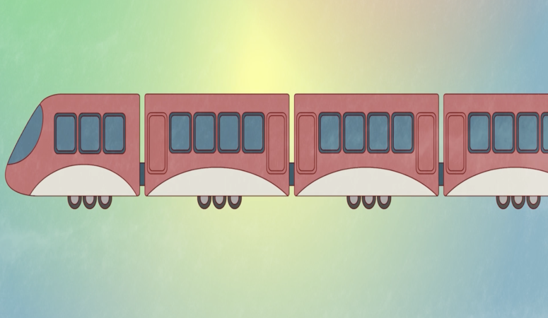

# 大和小
# Dà hé xiǎo
# Grand et petit

## 我的帽子很小。
## Wǒ de màozi hěn xiǎo.

> Mon chapeau est petit.

## 我的帽子很大。
## Wǒ de màozi hěn dà.

> Mon chapeau est grand.

## 我的包很輕。
## Wǒ de bāo hěn qīng.

> Mon sac est léger.

## 我的包很重。
## Wǒ de bāo hěn zhòng.

> Mon sac est lourd.

## 我的火車很短。
## Wǒ de huǒchē hěn duǎn.

> Mon train est court.

## 我的火車很長。
## Wǒ de huǒchē hěn cháng.

> Mon train est long.

## 我的書很薄。 
## Wǒ de shū hěn báo.

> Mon livre est fin.

## 我的書很厚。
## Wǒ de shū hěn hòu.

> Mon livre est épais.
