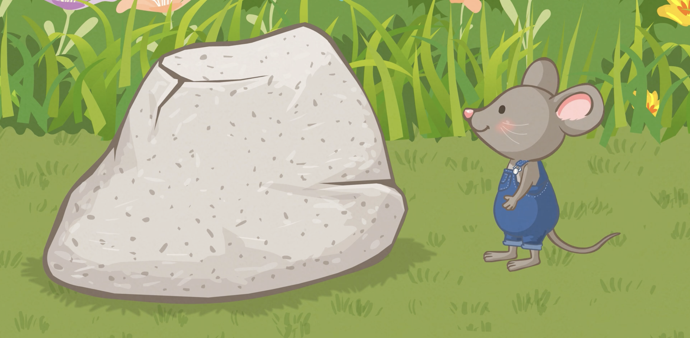

# 我看到
# Wǒ kàndào
# Je vois

## 我看到石头。
## Wǒ kàndào shítou.
### Je vois un rocher.

## 我看到螞蟻。
## Wǒ kàndào mǎyǐ.
### Je vois une fourmi.

## 我看到花。
## Wǒ kàndào huā.
### Je vois une fleur.

## 我看到蝴蝶。
## Wǒ kàndào húdié.
### Je vois un papillon.

## 我看到蜜蜂。
## Wǒ kàndào mìfēng.
### Je vois une abeille.

## 我看到树。
## Wǒ kàndào shù.
### Je vois un arbre.

## 我看到猫。
## Wǒ kàndào māo.
### Je vois un chat.

## 啊，快跑！
## Ā, kuài pǎo!
### Ah sauve qui peut !
