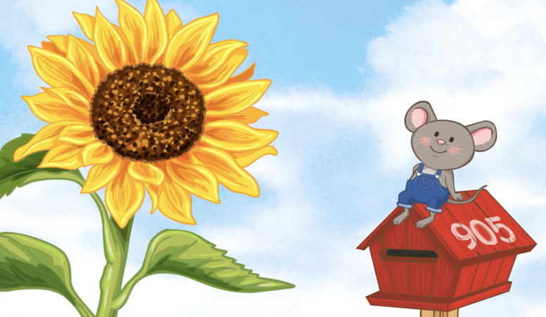

## 我看到石頭。
## Wǒ kàndào shítou.

> Je vois un rocher.

## 我看到螞蟻。
## Wǒ kàndào mǎyǐ.

> Je vois une fourmi.

## 我看到花。
## Wǒ kàndào huā.

> Je vois une fleur.

## 我看到蝴蝶。
## Wǒ kàndào húdié.

> Je vois un papillon.

## 我看到蜜蜂。
## Wǒ kàndào mìfēng.

> Je vois une abeille.

## 我看到樹。
## Wǒ kàndào shù.

> Je vois un arbre.

## 我看到貓。
## Wǒ kàndào māo.

> Je vois un chat.

## 啊，快跑！
## Ā, kuài pǎo!
> Ah sauf qui peut !
