# 青蛙和他們的國王
> Les grenouilles et leurs rois

## 很久以前，森林裏有個美麗的池塘。青蛙們在那裏快樂地生活。
## “多麼愜意的生活！在這兒我們擁有想要的一切。” 大家都很贊同。
## “但是我們沒有國王。” 一隻青蛙說。“森林裏的其他動物們都有自己的國王。”

> Il était une fois un bel étang dans la forêt. Les grenouilles y vivaient heureuses.
"Quelle vie agréable ! Nous avons tout ce que nous voulons ici", disaient-elles toutes.
"Mais nous n'avons pas de roi", dit une grenouille. "Les autres animaux de la forêt ont tous leur propre roi."

## “是的，其他所有的動物都爲自己的國王感到驕傲。” 另一隻青蛙說。
## “他們可能會因爲我們沒有國王欺負我們。” 
## “讓我們去找森林之神要一個國王吧。” 一隻青蛙建議道。
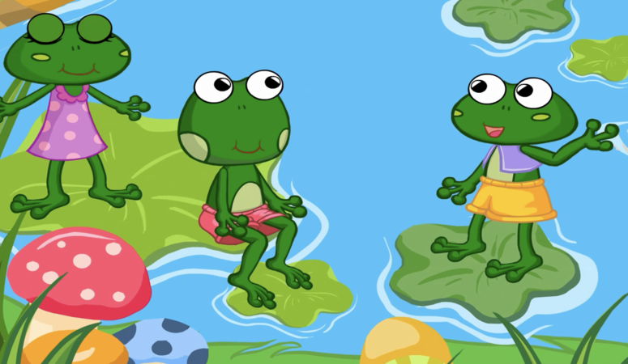
> "Oui, les autres animaux sont tous fiers de leurs rois", dit une autre grenouille.
"Ils pourraient se moquer de nous parce que nous n'avons pas de roi".
"Allons trouver le Dieu de la forêt et demandons un roi", a suggéré une grenouille.
## 於是青蛙們來到森林之神面前。
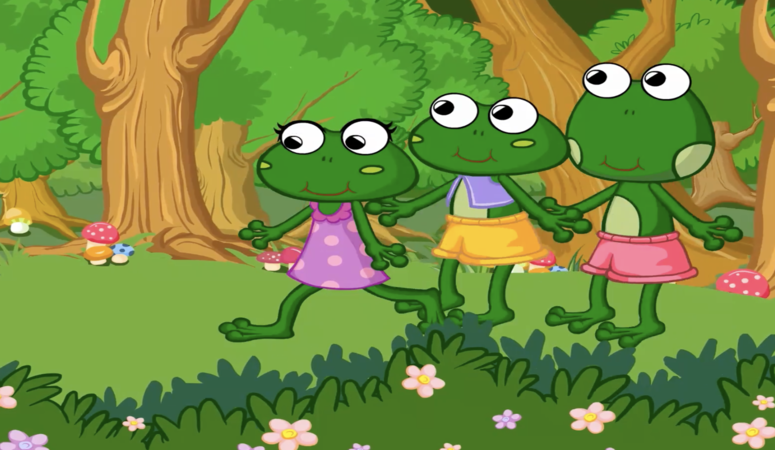
## “森林之神，你能幫幫我們嗎？” 
## “怎麼了？” 
## “我們想要一個國王。” 
## “你們現在自由快樂。爲什麼想要一個國王？” 森林之神問。
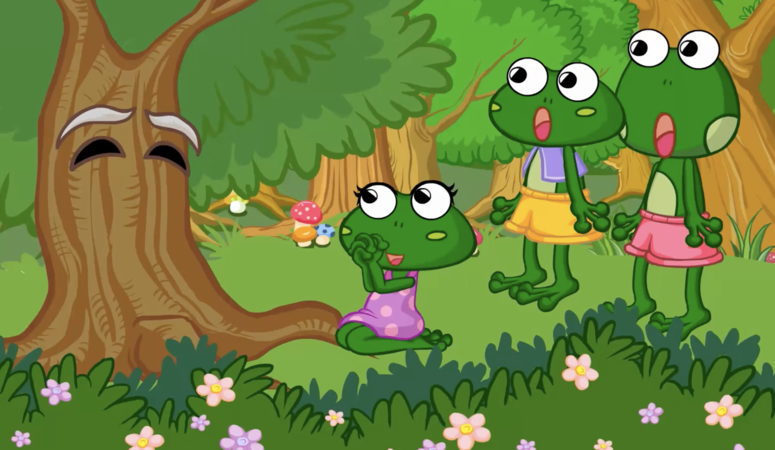
> Alors les grenouilles s'approchèrent du Dieu de la Forêt.
"Dieu de la forêt, peux-tu nous aider ?"
"Qu'est-ce qu'il y a ?"
"Nous voulons avoir un roi."
"Vous êtes libres et heureux maintenant. Pourquoi souhaitez-vous un roi ?" demanda le Dieu de la forêt.
## 青蛙們做出瞭解釋。“森林裏的其他動物都有一個國王，只有我們沒有。
## 他們可能會嘲笑我們。
## 森林之神，請給我們一個國王吧。” 青蛙們說。
## “你們應該爲你們擁有的感到慶幸。” 森林之神說。“不過既然你們堅持，我就滿足你們的願望。” 
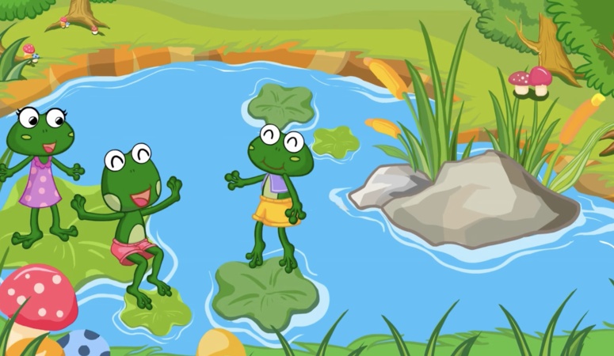
> Les grenouilles s'expliquèrent. "Les autres animaux ont tous un roi. Nous sommes les seuls à ne pas en avoir."
"Ils pourraient se moquer de nous."
"Dieu de la forêt, donne-nous un roi," dirent les grenouilles.
"Vous devriez être heureux de ce que vous avez", dit le Dieu de la forêt. "Mais puisque vous insistez, je vais exaucer votre souhait."
## 快樂的青蛙們回到家等待自己的國王。突然，一根樹幹從天而降。噗咚！
## “快跑，有東西在攻擊我們！” 青蛙們哭喊着潛入池塘底部。過了一會兒，池塘恢復了平靜。“哦，這一定是我們的國王。” 一隻青蛙說。
> Les grenouilles heureuses rentrèrent chez elles pour attendre leur roi. Soudain, une bûche tomba du ciel. Splash !
"Cours ! Quelque chose nous attaque !" crièrent les grenouilles, et elles plongèrent au fond de l'étang.
Après un moment, l'étang était à nouveau calme. "Oh, ça doit être notre roi", dit l'une des grenouilles.
## “是的，我們的國王來了。讓我們向他致敬。” 但是青蛙們發現他們的國王一動不動。
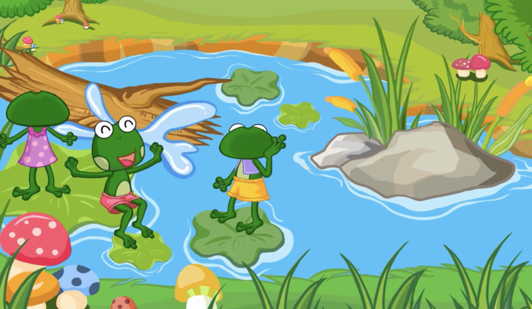
## “這只是一根木頭罷了！” 一隻青蛙說。
## 於是他們坐在樹幹上，還對它做鬼臉！
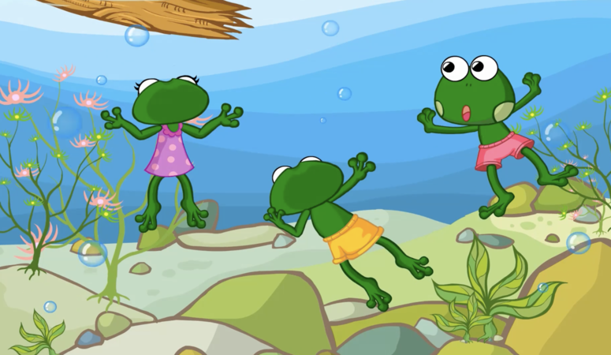
> "Oui, notre roi est arrivé. Allons lui présenter nos respects". Mais les grenouilles constatèrent que leur roi ne bougeait pas du tout.
"Ce n'est rien qu'une bûche !" dit une grenouille.
Alors elles s'assirent sur la bûche et lui firent même des grimaces !
## 青蛙們對他們的國王很不滿意。
## “多麼傻的國王！我們的國王並不是一個真正的國王。” 
## “其他的動物會戲弄我們的國王。” 
## “讓我們回去找森林之神要一個真正的國王。” 他們討論着說。
## 於是青蛙們又來到森林之神面前。
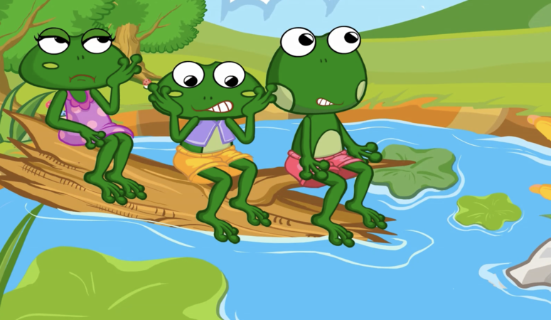
> Les grenouilles étaient mécontentes de leur roi.
"Quel roi insensé ! Notre roi n'est pas un vrai roi."
"Les autres animaux pourraient se moquer de notre roi."
"Retournons trouver le Dieu de la forêt et demandons un vrai roi", discutèrent-elles.
Les grenouilles retournèrent donc voir le Dieu de la forêt.
## “神通廣大的神！請賜給我們一個真正的國王。” 他們請求道。
## 森林之神對此感到很驚訝。
## “嗯。好吧，我再給你們一個新的國王。” 他宣佈道。
## 快樂的青蛙們回到家裏等待新的國王。很快，一條鰻魚出現在池塘裏。
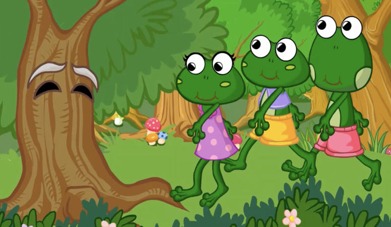
> "Dieu tout-puissant ! S'il vous plaît, donne-nous un vrai roi", ont-ils demandé.
Le Dieu de la forêt en fut surpris. "Hmm. D'accord, je vais vous donner un autre nouveau roi", annonça-t-il.
Les grenouilles heureuses rentrèrent chez elles pour attendre le nouveau roi. Bientôt, une anguille apparut dans l'étang.
## “你們好！我是你們的新國王。” 他說，“讓我們和睦相處吧。” 
## “好極了！” 青蛙們很開心。“我們會聽從您的指示。” 
## 但是溫順的鰻魚從來沒有發出任何命令。他只是享受地在池塘裏游來游去。
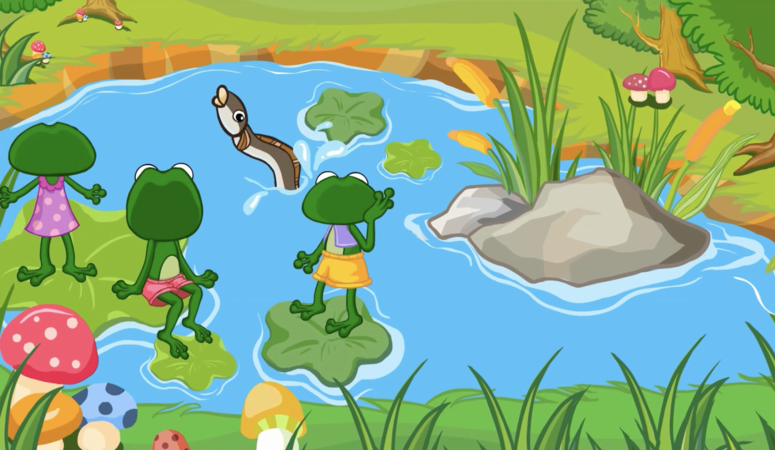
> "Bonjour ! Je suis votre nouveau roi", a-t-il dit. "Entendons-nous bien ensemble."
"Super !" Les grenouilles étaient heureuses. "Nous allons suivre tes instructions."
Mais l'anguille docile ne donnait jamais d'ordres. Elle aimait juste nager autour de l'étang.
## 於是青蛙們又召開了一次會議。
## “這個國王不好。鰻魚作爲一個國王來講太溫厚了。” 
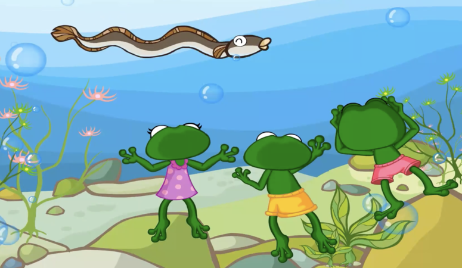
## “你說得對。其他的動物也會嘲笑他。” 
## “讓我們再去找森林之神要一個更好的國王。” 他們說。
> Alors les grenouilles convoquèrent une autre réunion.
"Ce roi n'est pas bon. L'anguille a trop bon caractère pour être un roi."
"Ce que vous dites est vrai. Les autres animaux vont se moquer de lui aussi."
"Retournons voir le Dieu de la forêt et demandons un meilleur roi !" dirent-elles.
## 青蛙們再一次找到森林之神。
## “神通廣大的神，請給我們一個更好的國王。” 他們請求道。
## “請賜給我們最強大的國王，不然我們會再回來的。”
> Les grenouilles retrouvèrent le Dieu de la forêt.
"Dieu tout-puissant, donne-nous un meilleur roi," demandèrent-elles.
"S'il te plaît, donne-nous le roi le plus fort, ou nous reviendrons sans cesse pour en demander un autre."
## 森林之神很生氣。“我已經給你們派了兩位好國王讓你們能自由地生活。你們卻不知足！好吧，我給你們派一個大的，強壯的國王！” 
## 青蛙們高興地回家等待他們強大的國王。
> Le Dieu de la forêt était en colère. "Je vous ai envoyé deux bons rois qui vous ont laissé vivre librement. Mais vous n'étiez pas satisfaits ! Très bien, je vais vous envoyer un roi grand et fort !"
Les grenouilles rentrèrent joyeusement chez elles pour attendre leur roi fort.
## “現在其他的動物們不會再嘲笑我們的國王了。” 他們說。
## 很快，森林之神派了蒼鷺到池塘。當青蛙們看到蒼鷺時很高興。
## “哦，看我們的新國王！”
## “他看上去如此高大完美！”
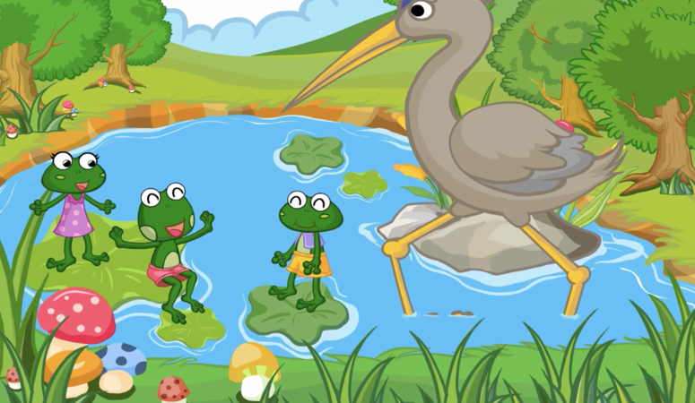
> "Maintenant les autres animaux ne se moqueront plus de notre roi", dirent-ils.
Bientôt, le Dieu de la forêt envoya un héron à l'étang. Quand les grenouilles virent le héron, elles furent heureuses.
"Oh, regardez notre nouveau roi !"
"Il a l'air si grand et si merveilleux !"
## 但是蒼鷺叼起一隻青蛙吃掉了。
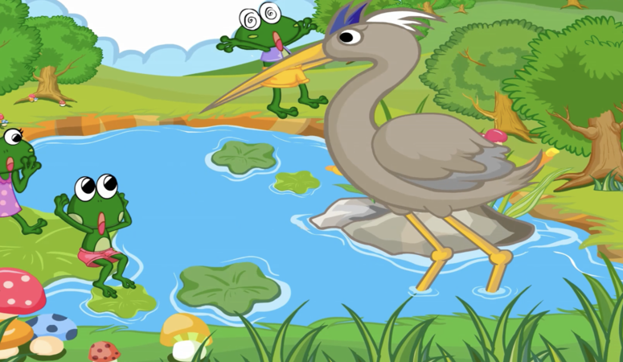
## “天啊！快跑！快跑！” 其他青蛙哭喊道。
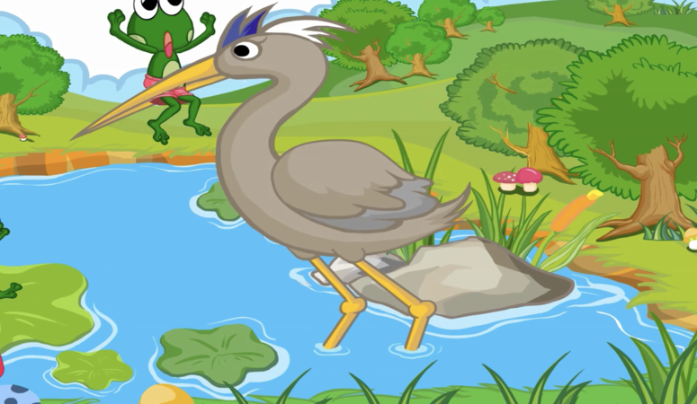
## 但是太遲了。蒼鷺吞下了一隻又一隻的青蛙。池塘裏一隻青蛙都沒有了。
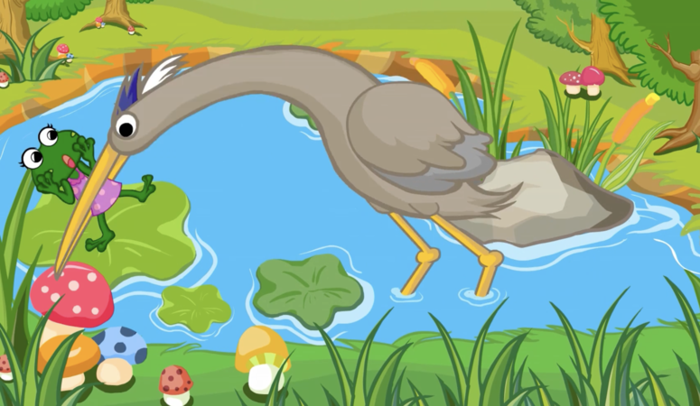

## 森林之神看着蒼鷺飛走了。“有的時候，人們應該學會滿足於現在所擁有的。”

> Mais le héron a ramassé une grenouille et l'a mangée.
"Oh là là ! Courez ! Cours !" criaient les grenouilles.
Mais il était trop tard. Le héron dévora une grenouille après l'autre jusqu'à ce qu'il n'y en ait plus aucune dans l'étang.
Le Dieu de la forêt regarda le héron s'envoler. "Parfois, les gens devraient apprendre à se satisfaire de ce qu'ils ont."