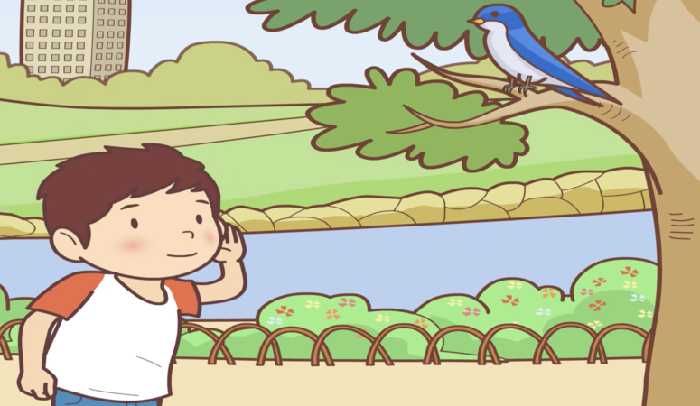
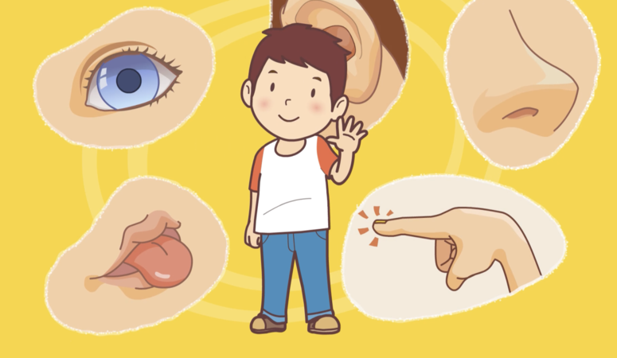

# 我的五種感官
Wǒ de wǔ zhǒng gǎnguān
> Mes cinq sens

## 我有五種感官。
### Wǒ yǒu wǔ zhǒng gǎnguān.
> J'ai cinq sens.

## 我用眼睛看。
### Wǒ yòng yǎnjing kàn.

> Je regarde avec mes yeux.

## 我看到青蛙。
### Wǒ kàndào qīngwā.

> Je regarde la grenouille.

## 我用耳朵聽。
### Wǒ yòng ěrduo tīng.

> J'entends avec mes oreilles.

## 我聽到鳥叫。
### Wǒ tīngdào niǎo jiào.

> J'entends le cri des oiseaux.

## 我用鼻子聞。
### Wǒ yòng bízi wén.

> Je sens avec mon nez.

## 我聞到玫瑰花香。
### Wǒ wéndào méiguīhuā xiāng.

> Je sens le parfum des roses.

## 我用舌頭嘗。
### Wǒ yòng shétou cháng.

> Je goûte avec ma langue.

## 我嚐到糖果的味道。
### Wǒ chángdào tángguǒ de wèidao.

> Je goûte la saveur du bonbon.

## 我用手摸。
### Wǒ yòng shǒu mō.

> Je touche avec ma main.

## 我摸到冰。
### Wǒ mōdào bīng.

> Je touche de la glace.

## 不管我做什麼，我都用到五種感官。
### Bùguǎn wǒ zuò shénme, wǒ dōu yòngdào wǔ zhǒng gǎnguān.

> Quoi que je fasse, j'utilise mes cinq sens.