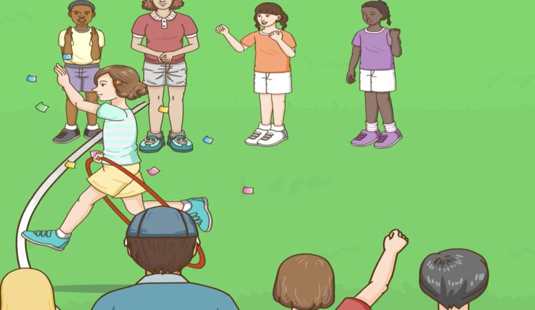

## Mon équipe

## 我的隊伍
### Wǒ de duìwu
> Mon équipe

## 她是第一個。
### Tā shì dì yī ge.

> Elle est la première.

## 他是第二個。
### Tā shì dì èr ge.

> Il est le second.

## 她是第三個。
### Tā shì dì sān ge.

> Elle est la troisième.

## 他是第四個。
### Tā shì dì sì ge.

> Il est le quatrième.

## 他是第五個。
### Tā shì dì wǔ ge.

> Il est le cinquième.

## 她是第六個。
### Tā shì dì liù ge.

> Elle est la sixième.

## 他是第七個。
### Tā shì dì qī ge.

> Il est le septième.

## 她是第八個。
### Tā shì dì bā ge.

> Elle est la huitième.

## 她是第九個。
### Tā shì dì jiǔ ge.

> Elle est la neuvième.

## 我是第十個。
### Wǒ shì dì shí ge.

> Je suis la dixième.

## 我的隊伍真棒！
### Wǒ de duìwu zhēn bàng !

> Mon équipe est super !